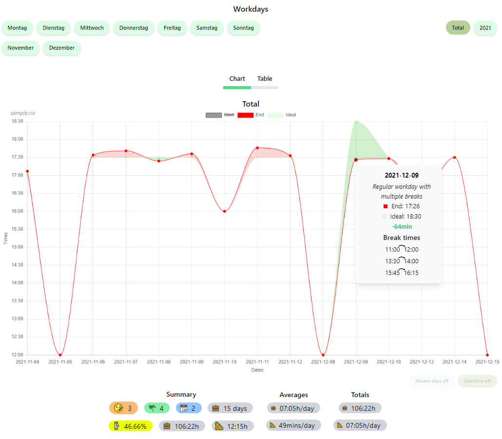

# Workdays

## What is this?
This is a visualizer tool for your work data.  
Drag and drop a CSV file with such data anywhere onto this area to get started.

## Example


## How to use
Create a CSV file with these columns on the first row:  
`date;startWorkTime;endWorkTime;breaks;sick;vacation;holiday;notes`  
  
Fill in your data. Example:  
```csv
2022-01-01;08:00;17:00;12:00->13:00;0;0;0;  
2022-01-02;08:00;17:00;11:00->11:30,14:30->15:00;0;0;0;Some example note
```

You can leave out any days you do not want to be displayed as well, gaps are supported.

## Limitations
This tool is not meant to be used for work that spans multiple days.
Your work needs to start and end on the same day for this tool to accurately work.

## Attribution
All emojis designed by [OpenMoji](https://openmoji.org/) – the open-source emoji and icon project. License: [CC BY-SA 4.0](https://creativecommons.org/licenses/by-sa/4.0)
